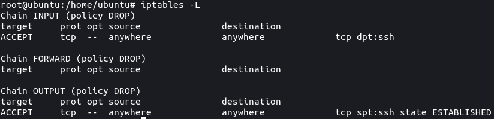
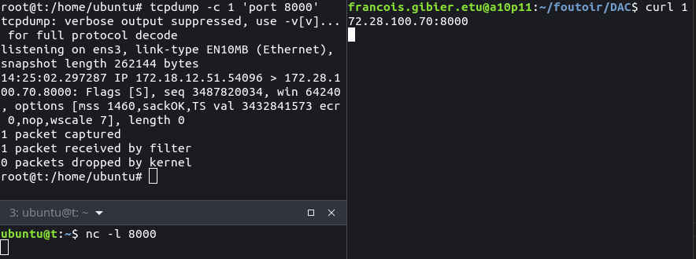
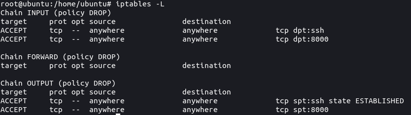
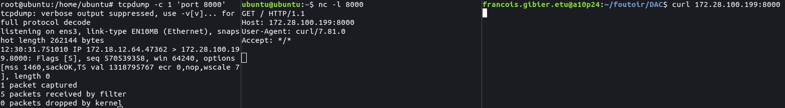

# DAC

## Configuration du pare-feu avec les iptables

Par défaut, une instance d'ubuntu va avoir tous ses ports ouverts et le firewall ne bloque aucune IP.

Je passe d'abord en utilisateur root pour plus de simplicité avec `su root`

Pour bloquer tous les ports sauf le port ssh il faut d'abord autoriser les requêtes allant sur le port 22 de la machine (port ssh) ensuite on accepte en sortie que le trafic déjà établie et provenant du port 22.
On peut aussi refuser les requêtes forward, ici on en a pas besoin, on ne redirige pas les requêtes.

```bash
iptables -A INPUT -p tcp -m tcp --dport 22 -j ACCEPT;
iptables -A OUTPUT -p tcp --sport 22 -m state --state ESTABLISHED -j ACCEPT;
iptables -P INPUT DROP;
iptables -P OUTPUT DROP;
iptables -P FORWARD DROP;
```



On va maintenant écouter le port 8000 avec netcat et capturer les paquets reçus avec tcpdump, on effectue ensuite un curl sur ce port pour voir si on peut accéder ou non au port 8000.



On constate que le serveur netcat ne reçoit pas la requête, car elle est interceptée avant par le filtre du pare-feu et refusée, on compte 1 seul paquet qui est le premier paquet de la poignée de main tcp pour initialiser la connexion.

Si maintenant on autorise le trafic sur le port 8000 en faisant :

```bash
iptables -A INPUT -p tcp --dport 8000 -j ACCEPT;
iptables -A OUTPUT -p tcp --sport 8000 -j ACCEPT;
```



Et si on refait la capture de trames et qu'on fait une requête http sur le port 8000 (sur le serveur netcat) :



On peut maintenant voir que le trafic passe bien et que le serveur netcat a bien reçu la requête, si on le coupe, le curl recevra une réponse http vide ce qui veut dire que le trafic fonctionne aussi en output sur le port source 8000.
