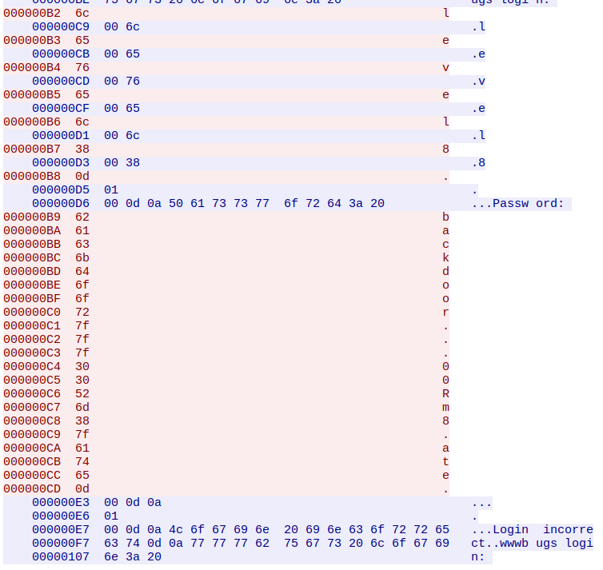
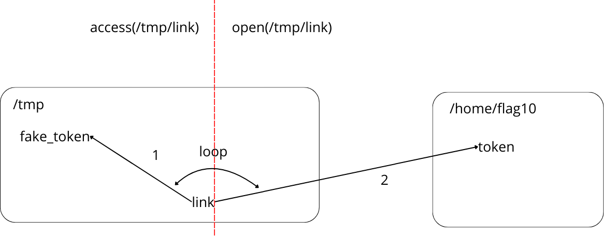

# DAC TP3

### 01)

On peut override le path et faire en sorte que ce ne soit pas echo qui soit exécuter mais un autre fichier.

Le problème vient de la command echo qui se trouvent au /bin/echo,
il suffit simplement de changer le path pour ajouter un directory avec une autre commande echo qui pourrait être n'importe quoi, par exemple on aurait un fichier echo dans le directory /home/flag01, avec les permissions d'éxécuter le fichier pour chacun des utilisateurs de la machine.

On remplace le PATH par /home/flag01:$PATH

```c
  system("/usr/bin/env echo and now what?");
```

Pour fixer la faille, il faudrait plutot exécuter cette ligne.

```c
  system("/usr/bin/env /bin/echo and now what?");
```

Pour récupérer le flag, on créé un fichier echo dans /tmp par exemple avec comme contenu `getflag`, on le rend exécutable avec `chmod +x /tmp/echo`, on remplace le PATH par /tmp:$PATH et on peut récupérer le flag en lançant le fichier ./flag01

### 02)

On peut changer la variable d'environnement USER en une commande bash et donc exécuter n'importe quel fichier.

Par exemple:

```bash
export USER=$(ps)
./flag02
```

Pour récupérer le flag, on fait:

```bash
USER='$(getflag)' ./flag02
```

Et on peut remplacer getflag par n'importe quelle commande.

### 03)

Le fichier writable.sh est un script qui exécute les fichiers présents dans le répertoire writable.d puis les supprime, et ce toute les 5 minutes.

### 04)

Ici, le problème est qu'on a pas les permissions de lire le fichier token.
Par contre, grâce au programme flag04, on a les permissions d'utilier le suid (SUID: Set User ID), qui est ici flag04, ce qui veut dire que, quand on éxécute le programme, on l'éxécute avec l'utilisateur **flag04**.

```
-rwsr-x--- 1 flag04 level04 7428 2011-11-20 21:52 flag04
```

Cependant, cela ne suffit pas, car le fichier à ouvrir est le fichier token. Il faut qu'on fasse passer ce fichier pour un autre en créant un lien symbolique appelé différemment de token vers ce fichier, le programme ne vérifiant pas que le fichier ouvert n'est pas token.

```bash
ln -s /home/flag04/token /tmp/file.txt
```

```bash
./flag04 /tmp/file.txt
```

On récupère ensuite le token et on peut se login avec l'utilisateur flag04 et récupérer le drapeau.

### 05)

On doit trouver des répertoires vulnerables et essayer de trouver des informations sensibles.
La plupart des fichiers et dossiers sont inaccessibles mais on remarque que le dossier **.backup** possède un sticky bit d'éxécution (x), ce qui veut dire qu'on peut utiliser un éxécutable pour récupérer les données du répertoire.
On peut notamment utiliser ls pour lister ou cat pour afficher les données du répertoire.
On constate qu'on a une archive à l'intérieur avec la permission de lecture du sticky bit. On peut donc copier le contenu dans un répertoire où on va pouvoir la décompresser.
```bash
cp ./.backup/backup-19072011.tgz ../level05/
```

On peut ensuite décompresser l'archive et on récupère la clé ssh privée de l'utilisateur. Et on peut se connecter en ssh et récupérer le flag.

### 06)

On nous dit que les credentials de l'utilisateur viennent d'un os legacy unix (legacy = système dépassé mais encore utilisé).
Les mots de passes sont alors stockés avec un hash dans le fichier /etc/passwd, on récupère donc le hash de l'utilisateur flag06, ce qui donne :
*flag06:ueqwOCnSGdsuM:993:993::/home/flag06:/bin/sh*. On peut ensuite le cracker avec un outil de crackage de mot de passe, ici j'utilise John the reaper.
On fait donc `john password` et on récupère le mot de passe "*hello*".
On peut donc maintenant se connecter en ssh à l'utilisateur flag06 avec son mot de passe et on récupère le flag.

### 07)

On peut voir dans le fichier *thttpd.conf* qu'il y a un serveur http *thttpd* qui tourne sur le port 7007 et qui sert les fichiers du répertoire */home/flag07*.

On peut également voir qu'on a un programme **index.cgi.cgi** (CGI (Common Gateway Interface) définit une méthode d'interaction entre un serveur web et des programmes générateurs de contenu externes). Ce programme effectue un ping sur un host spécifié, cependant, il n'y a aucune vérification de l'hôte entré par l'utilisateur, on peut donc y injecter du code.
On utilise donc le serveur pour éxécuter le programme à notre place en tant qu'utilisateur *flag07*.
On peut éxécuter une commande sur le serveur en faisant une commande comme :
```bash
wget localhost:7007/index.cgi?Host=%3B'echo "ok"'
```
Le *%3B* étant **;** encodé en url, ce qui fait que le ping est fait dans le vide et la commande est éxécutée après.

On peut donc récupérer le flag en faisant :
```bash
wget localhost:7007/index.cgi?Host=%3Bgetflag
```
et on obtient : `<html><head><title>Ping results</title></head><body><pre>You have successfully executed getflag on a target account
</pre></body></html>`


### 08)

On observe une capture tcpdump *capture.pcap*, pour mieux la visualiser, on peut l'exporter sur la machine hôte pour l'utiliser sur wireshark.
On peut soit créer un serveur http avec python `python -m SimpleHTTPServer`, soit utiliser netcat `cat capture.pcap | nc -l -p 8000`.

Après avoir récupéré le fichier, on l'ouvre dans wireshark, et si on l'affiche en ascii, on peut voir **backdoor...00Rm8.ate**.
On affiche les paquets sous forme héxadécimale et on a ceci :



On peut voir que les points dans les mots à la verticale ont pour valeur 0x7F, ce qui en ascii vaut 127, soit le caractère d'effacement. Ce qui donne **backd00Rmate**, qui est le mot de passe de l'utilisateur flag08.

### 10)

Le programme **flag10** est éxécuté avec le flag SUID (le programme est éxécuté avec l'utilisateur flag10). Cependant, la fonction access de la librairie unistd vérifie les permissions d'accès pour l'utilisateur réel et non le UID override par le programme. (cf access doc: using the real user ID in place of the effective user ID and the real group ID in place of the effective group ID). La fonction open ne vérifiant pas les permissions de l'utilisateur, on peut essayer d'outrepasser la fonction access.

On peut donc utiliser un lien symbolique, qui, au début de l'éxécution du programme pointerait vers un fichier auquel on a accès et qui ensuite (après la fonction access), pointerait vers le vrai token dans */home/flag10*.
Soit on met un délai, soit on fait une boucle infinie qui va changer continuellement le lien symbolique. J'ai opté pour la deuxième version. Et on a juste à lancer le programme avec le fichier */tmp/link* et l'adresse 127.0.0.1 (localhost) puis récupérer le token avec un serveur netcat par exemple. 

```bash
touch /tmp/link
nc -lk 18211
while true; do ln -sf /home/flag10/token /tmp/link; ln -sf /tmp/fake_token /tmp/link; done
while true; do /home/flag10/flag10 /tmp/link 127.0.0.1; done
```



Et on récupère le token *615a2ce1-b2b5-4c76-8eed-8aa5c4015c27*. On se connecte en ssh à l'utilisateur flag10 et on récupère le flag.