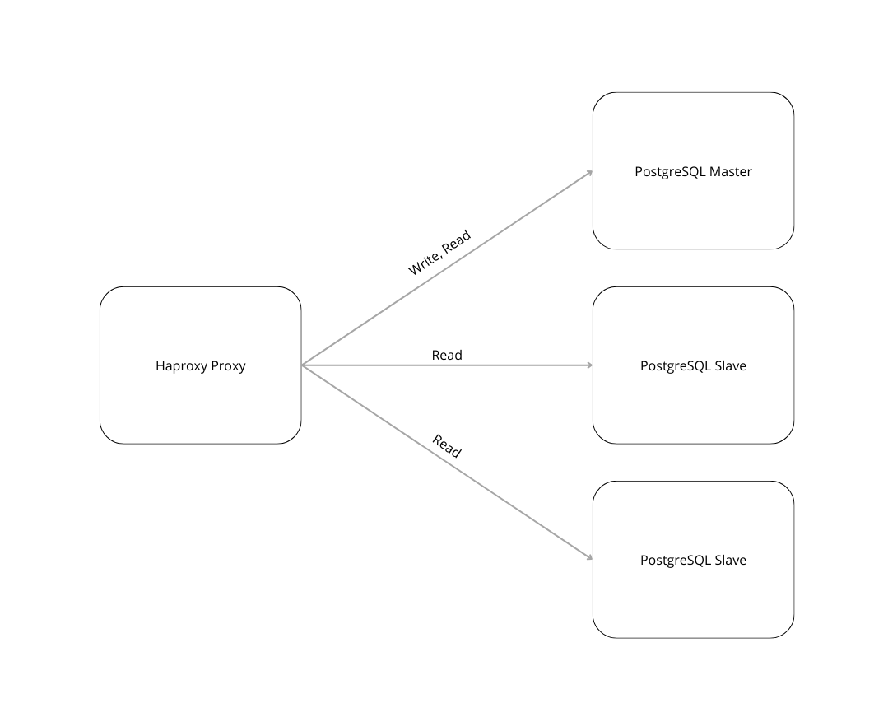

# Mise en place d'une architecture Master - Slave postgreSQL avec un proxy Haproxy

On va mettre en place la réplication d'une base de données PostgreSQL avec un Master, sur qui les requêtes de modification de la base de données seront redirigées, et les requêtes de sélection de données seront redirigées sur les slaves.
Toutes les requêtes passeront par un proxy haproxy qui redirigera les requêtes vers les instances.

Voici un schéma de l'architecture :



## Automatisation

Toutes les commandes necessaires à la mise en place de l'infrastructure sont:
```bash
terraform init terraform
terraform apply terraform
bash script.sh
```
Mais certaines sont détaillées en dessous pour expliquer ce qu'il se passe dans les scripts ansible.

## Provisioning des instances

Pour mettre en place l'architecture, on va utiliser terraform pour provider les instances. Ici, on utilisera des instances d'ubuntu22.04.
Par défaut, on aura un master, un proxy et deux slaves, soit quatre instances.

Il faut récupérer le fichier Openstack rc pour avoir toutes les informations nécessaires pour provisionner.

Puis on lance la commande:
```bash
terraform init terraform
terraform apply terraform
```

Selon les version de terraform, les commandes peuvent changer en:
```bash
terraform init -chdir=terraform
terraform apply -chdir=terraform
```

Ce qui va nous créé nos quatre instances.

## Configuration des instances avec ansible

### Configuration commune à toutes les instances

On lance le script **script.sh** avec bash (`bash script.sh`), le script va utiliser des templates de configurations de base de données postgreSQL et remplacer les adresses ip par les ip des instances.
On installe donc sur toutes les machines postgreSQL et toutes les dépendances requises à la configuration des machines (python et pip pour ansible, acl pour utiliser l'utilisateur postgres dans la machine virtuelle).
On créé ensuite l'utilisateur replication, qui sera l'utilisateur commun aux instances pour la replication et qui aura les droits de replication.

Quand on installe postgres, il y a un problème, la tâche d'installation de postgres va se lancer donc 2 à 3 fois (impossible de régler ce problème mais ça fonctionne).

### Configuration du master

On créé une table de *test_table* pour l'exemple, mais dans un context réel, la base de données serait vide à l'initialisation.
```bash
sudo --login --user=postgres psql
> CREATE TABLE test_table (id bigserial primary key, name varchar(20));
```

On ajoute le réseau de nos instances pour que le master accorde l'accès par les slaves. Ici, le réseau est *172.28.0.0/16*.
```bash
# /etc/postgresql/17/main/pg_hba.conf
host    replication     replication     172.28.0.0/16   md5
```

### Configuration des slaves

On ajoute le réseau *172.28.0.0/16* à la replication pour l'utilisateur replication avec le chiffrement md5 dans le fichier *pg_hba.conf* pour autoriser le master à se connecter.
```bash
# /etc/postgresql/17/main/pg_hba.conf
host    replication     replication     172.28.0.0/16   md5
```

On effectue une backup de la base de données master sur chacun des slaves avec la commande :
```bash
export PGPASSWORD="replication" && /usr/bin/pg_basebackup -h {{ master_ip }} -U replication -p 5432 -D /var/lib/postgresql/17/main -Xs -P -Fp -R
```
- -P pour utiliser la variable PGPASSWORD au lieu de demander à l'utilisateur d'entrer le mot de passe
- -Xs pour spécifier que la backup doit être faite en streaming et qu'elle doit s'effectuer régulièrement, et non une seule fois.
- -R pour replication
- -Fp pour la sortie en "plain format"

On doit ensuite changer les droits d'accès des dossiers de postgresql car ils sont en root pas défaut et postgresql a besoin des droits de lecture et écriture des fichiers (/var/lib étant un dossier système).
```bash
chown -R postgres:postgres /var/lib/postgresql/17/main
chmod -R 750 /var/lib/postgresql/17/main
```
On relance postgres et on a nos deux slaves qui répliquent la base de données master.
Si on effectue une modification sur la base de données du master, les 

On doit maintenant setup un proxy pour rediriger les requêtes sur les différents noeuds.

### Configuration du proxy

Ici, on va utiliser un proxy haproxy.
On installe donc haproxy sur l'instance destinée à être le proxy.

Le script d'installation (script.sh) remplace également le template *template_haproxy.cfg* et le copie dans la machine virtuelle.

En analysant les logs avec *journalctl -xe* ou dans le dossier */var/log/*, on peut voir que le proxy a réussi à se connecter aux instances de base de données.

On se connecte à l'instance:
```bash
ssh -i ssh/id_rsa ubuntu@{ ip proxy }
```

On peut requêter la base de données master en faisant (pour les requêtes d'update de la base):
```bash
psql -h localhost -U postgres -p 5000 -c "{ request }"
```

Ou bien requêter n'importe laquelle (même le master) pour des requêtes de lecture:
```bash
psql -h localhost -U postgres -p 5001 -c "{ request }"
```

Si on a une machine avec le cli de postgreSQL, on peut requêter le proxy de cette manière:
```bash
psql -h { ip proxy } -U postgres -p { 5000 ou 5001 } -c "{ request }"
```

## Tester la réplication

Pour tester la réplication, il faut se ssh dans le master et dans un des slaves. Pour ce faire, on fait la commande:
```
ssh -i ssh/id_rsa ubuntu@{ ip master }
sudo --login --user=postgres psql
> INSERT INTO test_table VALUES (1, 'name');
```
```
ssh -i ssh/id_rsa ubuntu@{ ip slave }
sudo --login --user=postgres psql
> SELECT * FROM test_table;
```

Et on peut voir que les données ont été répliquées.

## Suite

Il faudrait configurer les firewall des noeuds pour empêcher des connexions extérieures, et autoriser le traffic entrant seulement du proxy.

Avec ces scripts d'automatisation à l'aide d'ansible, il serait facile d'ajouter des noeuds esclaves en provisionnant des instances en plus avec terraform (cela n'impacterait pas les autres instances) et en lançant un script qui configure les nouveaux slaves avec ansible. Pas besoin de redémarrer la master node car on utilise ici des sous réseaux (172.28.0.0/16) et on a donc pas besoin de toucher à la configuration du master une fois déjà faite, il faudrait également reload le proxy mais pas le redémarrer (service haproxy reload).
