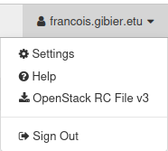

# Déploiement et Administration du Cloud
## TP5: Container and load balancing / monitoring

## Introduction

Nous allons mettre en place une architecture conteneurisée de serveurs Web reverse proxiés et load balancés, qui eux mêmes interragiront avec une architecture Master-Slave de bases de données SQL elles mêmes reverse proxiées et load balancées.

L'interêt de conteneuriser toute l'architecture est de la rendre reproductible et d'isoler chacune des parties de l'architecture avec ses dépendances pour les rendre portables et sécurisées. Cela permet également de gérer le cycle de vie de nos instances pour gérer au mieux la charge de travail plus ou moins importante.

L'architecture sera provisionnée avec Terraform sur un Cloud OpenStack.
La configuration des instances est entièrement automatisée à l'aide d'Ansible.

Une fois l'architecture mise en place, les métriques de nos différents services et machines seront exportés vers un serveur Prometheus et seront visualisées sur un serveur Grafana.

Voici un schéma de l'architecture mise en place:


## Prérequis

- Ansible: les playbooks, les files structures en rôles, les tâches de base, et quelques modules ansible: builtin, docker et postgres. Connaissances de Jinja2 pour le remplacement de templates.
- Terraform: Connaitre les bases de terraform, et les ressources du provider OpenStack ainsi que la génération de fichiers de configurations avec des templates et la gestion de clés SSH.
- PostgreSQL: Connaissances des bases de données SQL et plus particulièrement PostgreSQL. 
- Nginx: Bases de la configuration Nginx pour le reverse proxying et le load balancing, connaissances basiques du protocole HTTP.
- Prometheus: Connaissances de base de Prometheus.
- Grafana: Connaissances de base de Grafana et des datasources Prometheus.
- Docker: Familiariser avec le concept de conteneurisation, et bases de Dockerfile.
- Fail2Ban et nftables (bases)

## Structure de fichiers

- ansible/: Playbooks et rôles pour la configuration des instances.
- terraform/: Ressources terraform à créer pour mettre en place l'architecture.
- templates/: Fichiers de templates globales.
- webserver/: Serveur HTTPS écrit en C proposant une authentification à une base de données PostgreSQL.
- ssh/: Couple clé publique / privé pour la connexion SSH aux instances.
- images/: Images annexes, schéma de l'architecture.

## Provisioning

Les instances sont provisionnées avec Terraform sur un Cloud OpenStack, avec la clé SSH *ssh/id_rsa* pour se connecter aux instances. Ici on va créer 3 instances mais on peut en ajouter autant qu'on le veut pour augmenter la capacité à tenir la charge de travail, cependant l'architecture contient deux bottlenecks importants, ce qui fait qu'il y a une limite de réplication. 
Les machines virtuelles utilisent comme image de base une distribution Ubuntu22.04.

A la suite de la création des ressources, on va utiliser le template d'inventaire ansible [inventory.tpl](./templates/inventory.tpl) pour générer l'inventaire qui va être utilisé pour configurer les instances.

## Configuration

On utilise Ansible pour configurer les instances du début à la fin. On utilise les rôles Ansible pour créer le plus proprement les playbooks d'automatisation, ce qui permet une plus grande clarté et une séparation des tâches efficace, pour une meilleure extensibilité et évolutivité.

De plus, on peut essayer de simuler un polymorphisme avec les rôles et leurs variables en créant des tâches qui sont utilisées partout, ici on va les utiliser pour installer les packages nécessaires dans chacun des rôles.

On a un fichier [ansible.cfg](./ansible.cfg) pour configurer directement la connexion SSH, utiliser l'inventory généré par terraform, le pipelining pour améliorer la vitesse des playbooks, configurer l'utilisateur par défaut et s'octroyer les privilèges **root**.

## Serveurs Web

Dans le dossier *webserver*, on a un serveur HTTP en C, qui peut servir des dossiers, des fichiers, et renvoyer des données de fonctions. Le serveur aura un endpoint qui va requêter la base de données pour simuler un système d'authentification. Si l'authentification est correcte, la fonction renverra le hostname de la machine, sinon une réponse 401 UNAUTHORIZED.

On a également plusieurs endpoints du serveurs permettant de simuler de la charge, par exemple en allouant beaucoup de mémoire, en effectuant des calculs parallelisés ou simplement en ajoutant du délai de réponse.

### Conteneurisation des serveurs Web

On utilise Docker pour conteneuriser notre serveur Web, comme notre serveur est écrit en C, on va utiliser une image alpine, qui est une image minimifiée (< 5MB) et stable. Pour ne pas avoir à installer toutes les dépendances sur notre machine, on va créer notre image en deux étapes, la première servira d'image de build, et la seconde d'image de runtime. 
Voici le [Dockerfile](./webserver/Dockerfile) conteneurisant le serveur Web.

L'image build est ensuite upload sur une registry, la mienne est *francoisgib/tp5-dac*, et est en suite télécharger sur les instances pour créer les conteneurs. 

### Load Balancing des serveurs Web

Pour répartir la charge de travail, les requêtes HTTP seront redirigées sur les différents serveurs Web à l'aide d'un load balancer Nginx, qui est un type de load balancer applicatif de couche 4 (couche de transport) et 7 (couche applicative), ici on va seulement utiliser le load balancing à la couche 7 pour répartir les requêtes HTTP.
On utilise Nginx car c'est un logiciel qui est grandement utilisé en production, qui est stable, léger et donc permettant une réplication efficace (dans le cas où on aurait d'autres load balancer plus haut, par exemple physique) et offre un système de logging permettant un monitoring correct. De plus, Nginx est très performant avec de grandes charges de travail, ce qui est important sachant qu'il est un des goulot d'étranglement de l'architecture. Il est également simple de mettre en place un des healthchecks et de réagir en redirigant seulement les requêtes dans les services sains.

Pour configurer Nginx, on utilise un template de configuration avec Jinja2 qui va remplacer les serveurs à reverse proxier par les ips de nos instances.
```
upstream backend {
    
    server {{ hostvars[host]['ansible_host'] }}:8080 max_fails=3 fail_timeout=10s;
    
}
```

On a également une partie liée aux metrics, pour qu'on puisse les exporter et les analyser par la suite:
```
server {
    listen localhost:9999;
    location /metrics {
        stub_status on;
    }
}
```

Le serveur Nginx est configuré avec un certificat SSL auto-signé pour utiliser le protocole TLS1.2 et donc HTTPS. (les serveurs web ont les mêmes certificats).

Template de configuration du serveur Nginx: [nginx.conf](./ansible/roles/nginx/templates/template-nginx.conf.j2)

## Bases de données

Les bases de données seront des bases de données PostgreSQL, car c'est une solution hautement utilisée et qui a su faire ses preuves dans des environnements de production demandant une scalabilité accrue. 
On va utiliser la version 16 de PostgreSQL car c'est la dernière version utilisée en production et elle apporte beaucoup d'amélioration sur les performances, et la version 17 étant encore un peu "jeune".

Ces bases de données seront disposées en une architecture Master - Slave avec un Master et plusieurs Slaves, qui pourront êtres répliquées rapidement pour accueillir la charge de travail.
Ces bases de données seront reverse proxiées avec un Proxy PgPool-II qui est le proxy directement créé pour les bases de données PostgreSQL.

### Configuration commune

Le Master et les slaves ont une configuration commune.

D'abord, on créé l'utilisateur **replication** avec le mot de passe *replication*, on créé ensuite une table *test_table* pour créer le système d'authentification basique.

Pour la configuration des autorisations d'accès on autorise tout le sous-réseau des instances OpenStack à la connexion pour l'utilisateur postgres et à la replication pour l'utilisateur replicator, avec comme méthode d'authentification scram-sha-256 (on également aussi utiliser md5 et chiffrer le mot de passe à la place).

On autorise également la connexion en local de l'utilisateur postgres avec la base de données postgres en "trust" pour plus de flexibilité, mais en temps normal il faudrait également utiliser une authentification md5 même en local pour plus de sécurité.

```bash
# /etc/postgresql/16/main/pg_hba.conf

local   postgres        postgres                              trust         # Autorisation pour l'utilisateur postgres en local

host    replication     replicator      172.28.0.0/16         scram-sha-256 # Autorisation de l'utilisateur replicator à la replication dans le sous-réseau du Cloud

host    all             postgres        172.28.0.0/16         scram-sha-256 # Autorisation des utilisateur à la bases postgres dans le sous-réseau du Cloud (on a de
                                                                            # toutes façons que deux utilisateurs donc c'est comme ci on utilisait que postgres)
```
Template: [pg_hba.conf](./ansible/roles/postgres/files/pg_hba.conf)

### Configuration du Master

Ensuite, on doit configurer le Master pour pouvoir le répliquer sur des bases de données slaves.

On met le *wal_level* à replica (un niveau de logging assez fort pour la réplication), et on met le nombre maximum de slots de replication au nombre de slaves. On modifie le port en fonction de la configuration globale de l'architecture, par exemple avec la variable **postgres_default_port** dans *templates/inventory.tpl*.

On va également créé les slots de replication pour les slaves en effectuant une requête SQL, si on veut scaler dynamiquement les slaves, on ne recréera pas les slots déjà existants.
```sql
SELECT pg_create_physical_replication_slot('{{ item }}_slot') 
    WHERE NOT EXISTS (
        SELECT 1 FROM pg_replication_slots 
        WHERE slot_name = '{{ item }}_slot'
    );
```

```
# /etc/postgresql/16/main/postgresql.conf

listen_addresses = '*'
port = {{ portgres_port }}

wal_level = replica
max_replication_slots = {{ groups['slaves'] | length }}
```
Template: [postgresql.conf](./ansible/roles/master/templates/master_postgresql.conf.j2)

Enfin, on insert un utilisateur (username, password) pour vérifier que la réplication a été effectuée. 

### Configuration des Slaves

Pour configurer les slaves, on doit établir la connexion avec le Master pour répliquer ses données. Grâce à l'utilisateur *replicator* créé dans la configuration commune, on se connecte au master avec le slot de replication créé précédemment. On set le *hot_standy* à *on* pour recevoir les requêtes de lecture de données en état de réplication.

```bash
hot_standby = on
primary_conninfo = 'host={{ master_ip }} port={{ postgres_port }} user=replicator password=replicator'
primary_slot_name = '{{ inventory_hostname }}_slot'
```
Template: [postgresql.conf](./ansible/roles/slave/templates/slave_postgresql.conf.j2)

### Load Balancing des bases de Données

Pour load balancer les bases de données, rediriger les requêtes d'écriture dans le master et les requêtes de lecture dans les slaves, on va utiliser PgPool-II qui est le reverse proxy de PostgreSQL, il est grandement utilisé car très performant, il observe les métriques des bases de données et permet donc une observation globale des différentes bases. PgPool-II propose également un système de mise en cache et de healthcheck pour détecter les serveurs en échec. Le Proxy SQL PgPool-II va être installé dans le même noeud que le reverse proxy Nginx.

On va utiliser une image docker *bitnami/pgpool* pour le mettre en place, cette image est adéquate car elle est légère et permet une configuration simple à l'aide de variables d'environnement. On a donc un template d'environnement qu'on va appliquer lors de la création du conteneur.
On utilise encore une fois Jinja2, pour configurer le nombre de noeuds maximum (master + nombre de slaves), leur adresse ip et leur port. On peut également mettre un poids aux différents noeuds pour rediriger plus ou moins la charge dans certaines instances, cela peut être intéressant si certaines machines virtuelles ont plus de charge de travail que d'autres.

Template: [env.j2](./ansible/roles/pgpool/templates/env.j2)

## Monitoring

Après avoir mis en place l'architecture, il est maintenant important de savoir ce qu'il s'y passe, on va donc la monitorer.
Pour ce faire, il faut qu'on exporte les métriques de nos différents services vers un serveur centralisé qui pourra nous les afficher clairement, on veut pouvoir également mettre en place des évènements pour par exemple autoscaler les différents services en cas de charge de travail élevée.

### Prometheus

Pour centraliser les métriques, on va utiliser Prometheus, qui est un serveur spécialisé dans le monitoring permettant de récupérer certaines données de nos services, de savoir s'ils sont en échec ou non, entre autres. De plus, Prometheus est un logiciel open source et qui est grandement utilisé et possède donc énormément de ressources créées par la communauté, en particulier ce dont on besoin le plus: de Node Exporter.

Un Node Exporter va récupérer les métriques d'un service pour qu'un serveur (ici Prometheus) viennent les récupérer à son tour pour pouvoir les utiliser.

Il faut donc d'abord créer les Node Exporters de nos différends Noeuds.
Il existe déjà des images Docker de Node Exporters de PgPool-II, de bases de données PostgreSQL, de Nginx, des métriques des conteneurs (cadvisor), des métriques de fail2ban, et des métriques systèmes, on a seulement à les utiliser en spécifiant les url et port de nos services.

Après avoir créé les conteneurs pour l'exportation des métriques vers un serveur, il faut maintenant créer le serveur Prometheus qui va les centraliser.
Pareil, on va utiliser une image Docker de Prometheus et configurer ce serveur.

On a seulement à remplacer un template de configuration très simple à écrire pour importer toutes les métriques de nos différents services.
Template: [prometheus.yml.j2](./ansible/monitoring/roles/prometheus/templates/prometheus.yml.j2)

Avec cette configuration, le serveur Prometheus va scrapper les métriques de nos services toutes les 15 secondes.

### Grafana

Il est bien de centraliser nos métriques, mais maintenant il faut pouvoir les visualiser pour en extraire les informations importantes.
Pour intégrer cela, on va utiliser Grafana, c'est aussi un logiciel open source, sur lequel la communauté peut créer des graphiques pour visualiser les données de différentes datasources, dont Prometheus.

On lance l'image Docker de Grafana, puis on a directement un serveur prêt à l'emploi, il suffit maintenant seulement de créer une datasource, ici Prometheus.
Puis on ajoute différents graphiques créés par la communauté, par exemple:
- [System metrics](https://grafana.com/grafana/dashboards/1860-node-exporter-full)
- [Nginx metrics](https://grafana.com/grafana/dashboards/12708-nginx)
- [PostgreSQL metrics](https://grafana.com/grafana/dashboards/9628-postgresql-database)
- [PgPool-II metrics](https://b-peng.blogspot.com/2022/09/grafana-pgpool2-exporter.html)
- [cadvisor](https://grafana.com/grafana/dashboards/14282-cadvisor-exporter/)
- [Fail2Ban](https://grafana.com/grafana/dashboards/22197-suricata-logs-json/)

Les fichiers de configurations Ansible pour mettre en place le monitoring sont dans le dossier *ansible/monitoring*.

## Firewall

### Fail2Ban

Pour empêcher un client d'envoyer plusieurs requêtes indésirables, et également empêcher des attaques de brute force, on met en place fail2ban.
On installe fail2ban sur le serveur Nginx car c'est le seul point d'entrée du cluster, à l'intérieur, on a que des requêtes inter-service.
On ajoute donc un filtre et une jail fail2ban sur la machine du proxy. Pour plus de flexibilité et ne pas avoir à installer fail2ban sur la machine virtuelle, on utilise un conteneur Docker.
On limite donc pour un client le nombre de requêtes avec un status http 4xx à 5, après le client sera banni pendant 10 minutes.

### nftables

Le firewall a été configuré avec les nftables, les fichiers de configuration sont dans le dossier *nftables/files*, et le script ansible copie les fichiers de configurations dans les instances.

On laisse l'accès aux ports de maintenance comme ssh, et dns sur toutes les instances.
Sur le proxy (nginx et pgpool) on autorise le port 5432 et http et https, on laisse également grafana et prometheus pour voir les métriques et le trafic interne au sous-réseau du Cloud pour faciliter la configuration. Il faut également laisser l'accès à l'interface *docker0* de l'intérieur de la VM.
Sur les serveurs (web et postgresql), on laisse seulement le trafic venant du proxy, et on ferme le reste.

On aurait très bien pu créer plusieurs tables pour les différents services, mais cela aurait grandement compliqué la configuration des nftables. Autoriser le trafic dans le sous-réseau permet donc d'éviter de devoir créer beaucoup de tables, mais pourrait être un problème de sécurité.

[Configuration du proxy](ansible/nftables/files/proxy.conf)
[Configuration des serveurs](ansible/nftables/files/servers.conf.j2)

## Installation et utilisation de l'architecture

### Mise en place

Il faut au préalable avoir un fichier source du Cloud OpenStack de l'université pour pouvoir provisionner avec Terraform.
Téléchargeable dans le coin supérieur droit de l'application web openstack.



Pour charger les variables d'environnement:
```
source fichier.sh
```

Pour mettre en place l'architecture en une commande, on peut faire:
```
make
```
ou pour les versions vraiment anciennes: (peu de chances d'avoir une version aussi ancienne mais c'est le cas à l'université)
```
make all-old-terraform-version
```

Sinon, pour faire les commandes à la main:
```
terraform -chdir=terraform init
terraform -chdir=terraform apply -var "template_file=../templates/inventory.tpl" -auto-approve
terraform -chdir=terraform output -raw inventory_ini > inventory.ini
ansible-playbook ansible/master_playbook.yml
```

Avec une vieille version de terraform:
```
terraform init terraform
terraform apply -auto-approve -var "template_file=./templates/inventory.tpl" terraform
terraform output inventory_ini > inventory.ini
ansible-playbook ansible/master_playbook.yml
```

### Mise à jour des instances

Si on veut modifier la configuration de Nginx:
```
ansible-playbook ansible/update_nginx_config.yml
```

Si on veut modifier la configuration des bases de données:
```
ansible-playbook ansible/update_db.yml
```

Si on veut changer le nombre d'instances des bases de données:
```
ansible-playbook ansible/update_db.yml
```

Si on veut mettre à jour l'image des serveurs web:
```
ansible-playbook ansible/update_webservers.yml
```
et pour rebuild l'image en local (attention à bien pousser l'image sur votre registry, il n'est possible que de prendre l'image de ma registry)
```
docker build -t { tag } ./webserver
docker push { tag }
```

Pour clean après utilisation et détruire l'architecture:
```
rm inventory.ini
terraform -chdir=terraform destroy -auto-approve
```

Les commandes sont très simples grâce à l'architecture ansible en rôles, qui facilite énormément les scripts, mais en contrepartie rend la structure de fichiers assez profonde.

Toutes ces commandes sont également dans le makefile.

### Utilisation

Pour utiliser les serveurs web load balancés par le serveur Nginx, il faut d'abord prendre l'ip du proxy dans *inventory.ini* et aller sur l'endpoint de base *https://{ ip_proxy }*.

Il y a ensuite plusieurs endpoints disponibles pour s'authentifier avec le username "username" et le password "password", ce qui va afficher le hostname d'une des instances des serveurs web. Il y a aussi plusieurs endpoints avec des boutons pour simuler de la charge sur les serveurs web, notamment le stress test CPU linpack (très bien pour vraiment voir une différence sur les graphiques grafana).

### Monitoring

Pour voir toutes les informations de monitoring avec grafana, il faut aller sur le port 3000 du proxy, et ensuite se connecter avec le username "admin" et le password "password". On a ensuite accès aux graphes pour monitorer les instances. Pour voir les métriques brutes et effectuer des requêtes dessus, on peut accéder au serveur prometheus sur le port 9090 du proxy.

Attention, pour le dashboard **Systems metrics**, seules les instances proxy, et les webservers ne sont affichés sur le dashboard, les noms sont dupliqués (je n'ai pas réussi à modifier le dashboard pour changer ça).

## Amélioration possibles

- Creation d'un Node Exporter pour le serveur HTTPS.
- Elastic search avec Kibana pour utiliser une autre solution que Grafana et Prometheus.
- Mise en place d'évènements d'autoscaling en cas de charge importantes. (et donc mise en place d'un alert manager)