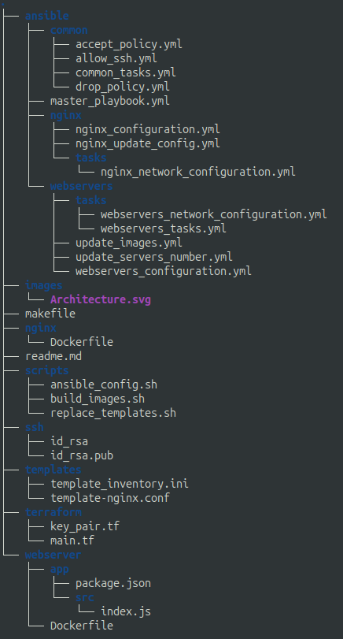

# Déploiement et Administration du Cloud
## TP5: Mise en place d'un load balancer Nginx pour des serveurs Web
### GIBIER François


Le but du TP est de mettre en place un load balancer qui redirige les requêtes vers différents serveurs http, ces serveurs doivent être instanciés chacun dans un conteneur docker dans une machine virtuelle (différente).

La configuration des instances est faite avec des scripts ansible et des scripts bash pour remplacer les templates et effectuer les différentes tâches.



- ansible/ fichiers de configuration des machines virtuelles.
- minimalserver/ serveur http simple en C et son Dockerfile.
- nginx/ Dockerfile de l'image nginx et configuration du serveur (après remplacement des templates)
- scripts/ scripts d'automatisation, remplacement de template, build et push des images.
- ssh/ clé ssh "factice" utilisée pour le TP
- templates/ templates remplacés pour configurer les machines.
- terraform/ fichiers terraform pour provisionner les instances.
- webserver/ serveur simple NodeJS et son Dockerfile.
- makefile: le fichier contenant les commandes pour mettre en place l'architecture.

## Provisioning avec terraform

Les instances des machines virtuelles sont provisionnés avec terraform sur le cloud OpenStack de l'Université, et l'image de base des instances est ubuntu22.04.
La clé ssh utilisée dans ce TP a été générée spécialement pour ce TP et est disponible dans le dossier *ssh*.

On provisionne une machine qui servira de reverse proxy (Nginx), et deux machines (ou plus) sur lesquelles les requêtes seront réparties.

## Remplacement des templates

On utilise deux templates ici, un template de l'inventaire ansible utilisé pour la configuration des instances, on remplace donc les adresses ip par celles des instances provisionnées avec terraform, ainsi que les variables utilisées pour configurarer les instances.

On a aussi le template de configuration du serveur Nginx, pareil que dans le template de l'inventaire ansible, on remplace les adresses ip par celles des instances.

## Gestion des images Docker

### Build des images

Pour le proxy, on va utiliser une image de base *nginx:alpine-slim* qui est une image minimifiée du reverse proxy Nginx (pour prendre le moins d'espace et ne pas avoir de fichiers inutiles dans notre conteneur Docker).

Maintenant, pour les serveurs web, on a plusieurs alternatives:
- on peut simplement renvoyer le hostname avec un simple serveur netcat, dans ce cas on peut utiliser une image docker netcat basique.
- on peut créer un simple serveur NodeJS qui renvoie le hostname et le builder avec une image *node:alpine* puis éxécuter le build avec une *alpine* simple.
- on peut écrire un serveur http à la main et utiliser une image scratch (vide).

Je propose ici les deux dernières options, un serveur simple NodeJS ainsi qu'un serveur http en C qui renvoient le hostname de la machine virtuelle.
L'avantage du serveur en C est qu'on peut le compiler avec ses dépendances (en un seul fichier, avec l'option --static de gcc), et donc ce fichier sera directement éxécutable par une image Docker vide (scratch), sans aucune installation supplémentaire, et donc avoir une image extrêmement petite (< 1mo).

Par défaut, les scripts vont utiliser le serveur C et non le serveur NodeJS. 
Pour passer à l'image NodeJS, il faut affecter une valeur à la variable d'environnement *NODE_SERVER*, par exemple en remplaçant `bash scripts/build_images.sh` par `NODE_SERVER=y bash scripts/build_images.sh` dans le makefile.

### Connexion à une registry d'images Docker

Pour mettre les images build dans une registry d'images, il faut pour cela se connecter à une registry, ici, j'utilise docker hub.
On fait donc la commande *docker login* et on rentre ses identifiants.

Il faut ensuite affecter le lien vers un repository d'une registry pour le projet à la variable d'environnement *DOCKER_REPOSITORY_PATH*, par exemple la mienne est *francoisgib\/dac-tp5* (attention à bien remplacer les / par des \\/).

Comme mon repository est public, au lieu de build et de push les images, on peut seulement les pull. Pour ce faire, au lieu de faire la commande `make`, il faut faire `make all-no-build`, sinon, vous devrez utiliser votre propre registry. (si on ne build pas les images, on va donc pull une ancienne version de la configuration du serveur Nginx, c'est pourquoi on copie la nouvelle configuration comme si on modifiait le nombre d'instances)

## Configuration avec ansible

On utilise ansible pour automatiser la configuration en ssh des instances.

On commence par installer Docker et les dépendances requises sur toutes les instances pour mettre en place l'architecture.

Ensuite, on configure les serveurs web:
- on pull l'image docker du serveur web depuis la registry
- on configure le firewall des instances, on laisse accessible le port ssh, ainsi que le port 8080 (http-alt) pour le reverse proxy.

Enfin, on configure le serveur Nginx:
- on pull l'image docker de notre load balancer nginx depuis la registry
- on configure le firewall, on laisse accessible le port ssh, le port http depuis l'extérieur et on autorise le traffic sur le port 8080 (http-alt) pour le sous-réseau correspondant aux instances des serveurs web (ici 172.28.0.0/16).

### Ajout ou supression de serveurs web

Si on veut changer le nombre de serveurs sur lesquels sont répartis la charge, on peut seulement relancer toute la configuration serveurs web et ansible ne va modifier que les nouvelles instances, comme l'image n'aura pas changé, les conteneurs déjà lancés ne seront pas relancés et tourneront pendant la configuration des instances.
On reload ensuite le serveur Nginx après avoir copié sa nouvelle configuration avec les nouvelles adresses ip des serveurs dans la machine virtuelle, puis dans le conteneur docker.

### Modification des images

Si on veut modifier l'image des serveurs web, on doit faire attention à ne pas relancer tout les conteneurs en même temps, il faut qu'on les mettent à jour progressivement.
Grâce à ansible, on peut effectuer le changement sur un pourcentage du nombre d'instances à la fois, ici, on va modifier 50% des instances à la fois pour qu'il y ai toujours des instances qui fonctionnent.
On a au préalable configurer Nginx pour qu'il détecte si un serveur est à l'arrêt et qu'il redirige donc les requêtes vers les autres serveurs:
```
server { ip_server }:8080 max_fails=3 fail_timeout=10s;
```

## Architecture

Voici le schéma de l'architecture mise en place.


Pour mettre en place l'architecture de zero, il faut faire la commande `make` (ou `make all-no-build`).